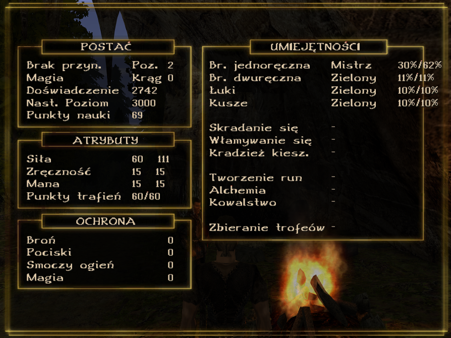

# BonusIndependentTraining-Union [Gothic 2 NotR]

**⚠️ IMPORTANT: ⚠️**
**This plugin was created primarily for Gothic II NotR and will not be compatible with most mods.**



A Union port of the Bonus Independent Training plugin for Gothic II NotR, originally created by elsky42 - visit [elsky42's ninja-bonus_independent_training repository](https://github.com/elsky42/ninja-bonus_independent_training) for the original Ninja version.
BonusIndependentTraining allows for more flexible character development by changing how training costs are calculated. Only "trained points" for a specific skill/attribute count toward the LP cost for further training, while bonuses from equipment or permanent bonuses (like stat increase potions) don't count.
The main goal of the project is to eliminate the need for Ninja extension.

## Features

- **Bonus-Independent Training Costs**: Only trained points count toward LP costs for further training
- **Equipment Bonus Freedom**: Use equipment bonuses without affecting training costs
- **Permanent Bonus Flexibility**: Permanent stat bonuses (potions, etc.) don't increase training costs
- **Trainer Compatibility Options**: Configure whether trainer limits check trained or effective values
- **Gothic II Compatibility**: Works with Gothic II NotR

## Installation

1. Download the latest release from the [Releases](../../releases) page
2. Extract `BonusIndependentTraining-Union.vdf` to your `Gothic II\Data\Plugins` folder
3. Launch Gothic II - the plugin will load automatically

## Usage

### How It Works
The plugin changes the training cost calculation system. When you train with a teacher:
- Only your **trained points** count toward the LP cost for further training
- Bonuses from equipment, rings, amulets, etc. are ignored in cost calculations
- Permanent bonuses from potions or other sources don't affect training costs
- This allows you to use permanent bonuses whenever you want without penalty

### Character Menu Display
When enabled in configuration, the character menu shows both values:
- Format: `Attribute [Trained] [Effective]`
- Example: `Strength 45 60` (45 trained, 60 with bonuses)

## Configuration

```ini
[BONUS_INDEPENDENT_TRAINING]
; Shows a message with trained and effective stats when you train
show_stats_when_training=false

; Whether trainer max attr/skill check uses trained or effective values
; true = trainer limits based on effective values
; false = trainer limits based on trained values only
trainer_max_against_effective=true

; Shows trained values in character menu alongside effective values
; Format: "Attribute [Trained] [Effective]"
show_real_stats_in_char_menu=true

; Default minimum value displayed for point-based attributes (Strength, Dexterity, Mana)
; If the trained value is lower than this, this value will be shown instead
; Useful for mods that change default starting values from 10
default_min_attribute=10

; Default minimum value displayed for percentage-based skills (1H, 2H, Bow, Crossbow)
; If the trained value is lower than this, this value will be shown instead
; Useful for mods where default percentage skills start at 5 instead of 10
default_min_percent=10
```

## Building from Source

### Prerequisites
- Visual Studio 2019 or later
- Union SDK v1.0m (if using earlier Union versions, you'll need zParserExtender)
- ZenGin headers (copy from Union SDK)

### Build Steps
1. Clone this repository
2. Copy ZenGin folder from Union SDK to `BonusIndependentTraining/ZenGin/`
3. Open `BonusIndependentTraining.sln` in Visual Studio
4. Select "G2A MT Release" configuration
5. Build the solution

## Credits

### Original Author
- **elsky42** - Original Bonus Independent Training implementation for Gothic II
- Original project: [ninja-bonus_independent_training on GitHub](https://github.com/elsky42/ninja-bonus_independent_training)

### Special Thanks
- **Union Team** - For the excellent Union SDK framework
- **Gothic Community** - For continued support and testing

## License

This project maintains compatibility with the original Bonus Independent Training license terms.

## Compatibility

This plugin creates hooks around the functions `B_TeachFightTalentPercent`, `B_TeachAttributePoints`, `B_RaiseFightTalent`, `B_RaiseAttribute` and `B_BlessAttribute` to prevent them from changing the real attributes or fight talents. The plugin should be highly compatible with other mods unless they require the real attributes or fight talents to be changed by these specific functions.

- **Gothic II NotR**: ✅ Supported  
- **Other mods**: ❌ Not compatible with most mods
- **Other Plugins**: Compatible with most Union plugins

## Troubleshooting

### Plugin Not Loading
- Ensure `BonusIndependentTraining.vdf` is in the correct folder: `Gothic II\Data\Plugins`
- Check that Union is properly installed
- Verify Gothic II version compatibility

### Training Costs Seem Wrong
- Remember that only trained points count toward LP costs, not equipment bonuses
- Check configuration settings in Gothic.ini

### Character Menu Not Showing Trained Values
- Enable `show_real_stats_in_char_menu=true` in Gothic.ini
- Restart the game after changing configuration

## Contributing

This is a community project. Feel free to:
- Report bugs in the [Issues](../../issues) section
- Submit improvements via Pull Requests
- Share feedback and suggestions
- Discord: raster96

---

**Note**: This is an unofficial port. For the original Ninja version, visit [elsky42's ninja-bonus_independent_training repository](https://github.com/elsky42/ninja-bonus_independent_training).
